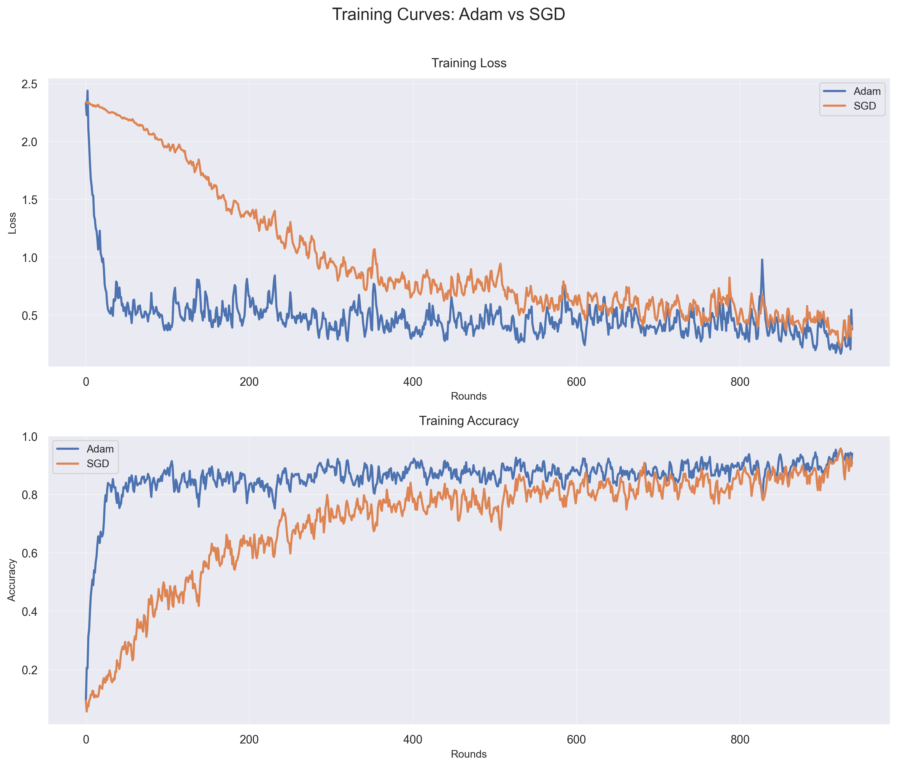

# neuralnet-cpp


[](https://opensource.org/licenses/MIT)

This is a PyTorch-like neural network framework in pure C++ from scratch, using only C++ STL.

Currently supports:

Layers:
-   [Linear](include/modules/layers/linear.hpp)
-   [Dropout](include/modules/layers/dropout.hpp)
-   [Conv2d](include/modules/layers/conv2d.hpp)
-   [Flatten](include/modules/layers/flatten.hpp)
-   [MaxPool2d](include/modules/layers/max_pool.hpp)  

Activation:
-   [ReLU](include/modules/activations/relu.hpp)
-   [Softmax](include/modules/activations/softmax.hpp)

Loss function:
-   [Mean Squared Error](include/modules/losses/mse.hpp)
-   [Cross Entropy Loss](include/modules/losses/cross_entropy.hpp)

Optimizer:
-   [Adam](include/modules/optimizers/adam.hpp)
-   [SGD (Stochastic Gradient Descent)](include/modules/optimizers/sgd.hpp)

Container:
-   [Sequential](include/modules/containers/sequential.hpp)

More to come.

> [!NOTE]
> To support and foster the growth of the project, you could ⭐ [star](https://github.com/lucaswychan/neuralnet-cpp) this project on GitHub. Discussion and suggestions are more welcome!

## Training Curves

Here are the training curves comparing Adam and SGD optimizers by running MLP on MNIST with batch size = 64, epoch = 1, learning rate = 0.01:



The codes to obtain the data are written in pure C++ from scratch. For the details of the training pipeline, you can refer to [main.cpp](examples/main.cpp).

## Get Started

This project requires C++23, GCC >= 13.3, and CMake >= 3.20 to compile. Please make sure you have [GCC](https://gcc.gnu.org) and [CMake](https://cmake.org/) installed.

For **Mac OS**, run the following commands:

```bash
brew install cmake
brew install gcc
```

If there is any problem, please try uninstalling `cmake` and `gcc`, and reinstalling them afterward. 

For **Linux**, run the following commands:

```bash
sudo apt update
sudo apt install cmake
sudo apt install build-essential
```

Get the repository:

```bash
git clone https://github.com/lucaswychan/neuralnet-cpp.git
cd neuralnet-cpp
```

Build the project:

```bash
./build.sh
```

Run the example:

```bash
./main.sh
```

## Tensor from Scratch

I implemented a tensor from scratch as well and integrate it to my neural network implementation. The detailed implementation of `Tensor` can be found in [`include/core/tensor.hpp`](include/core/tensor.hpp).

For more details about tensor, please refer to [tensor tutorial](docs/tensor.md).

## Sequential Container

To simply create your own neural network by stacking layers, feel free to use [`Sequential`](include/modules/containers/sequential.hpp). It accepts an array of pointers of any subclass of [`Module`](include/core/module.hpp).

### Example Usage

```cpp
#include "sequential.hpp"
#include "module.hpp"
#include "linear.hpp"
#include "relu.hpp"
#include "dropout.hpp"
#include <vector>
using namespace nn;
using namespace std;

Sequential layers = Sequential({ new Linear(768, 256), 
                                 new ReLU(), 
                                 new Dropout(0.2),
                                 new Linear(256, 128),
                                 new ReLU(),
                                 new Dropout(0.2),
                                 new Linear(128, 10),
                              })

/*
To perform forward pass, simply do 'output = layers(input)'

Similarily, do 'layers.backward(grad_output)' to perform backward pass (grad_output should be obtained from the backward pass of the criterion (i.e. grad_output = criterion.backward())).

For more details, please check main.cpp in examples
*/
```

## Module API

The module API is defined in [`include/core/module.hpp`](include/core/module.hpp).

To build your custom module, follow the instructions in `include/core/module.hpp`.

### Example usage

```cpp
#include "module.hpp"
using namespace nn;

// Your code here
class MyModule : public Module {
    public:
        virtual Tensor<> forward(const Tensor<>& input) override {
            // Your code here
        }
        virtual Tensor<> backward(const Tensor<>& grad_output) override {
            // Your code here
        }
};
```

## TODO

Please refer to the [TODO list](https://github.com/lucaswychan/neuralnet-cpp/blob/main/TODO.md).

## License

This project is licensed under the MIT License - see the [LICENSE](LICENSE) file for details.
